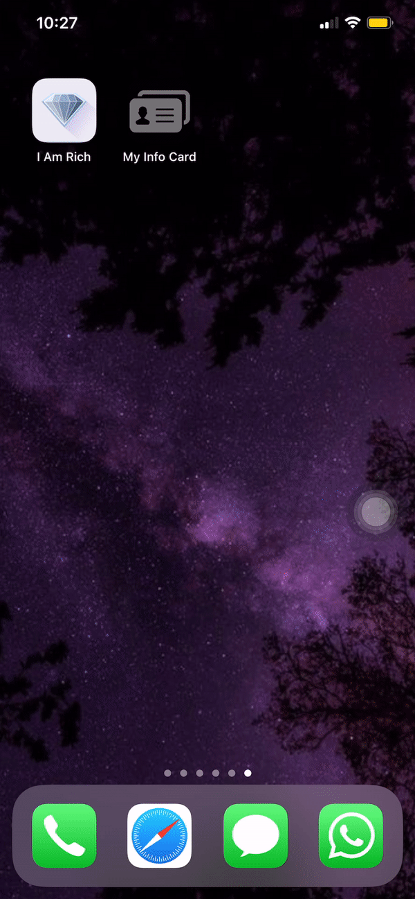

# My-Info-Card-UI
This is a single screen iOS written in swiftUI. This application displays your picture, mobile number and email. This is a virtual information handy card.

<table>
 <tr>
    <td> • GIF </td>
  </tr> 
  <tr>
    <td> </td>
  </td>
  </tr>
